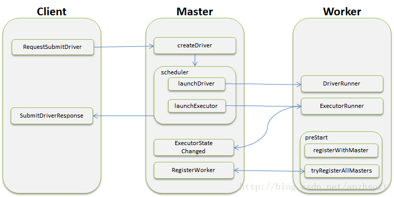

# [Standalone模式下Client-Master-Worker通信机制](http://blog.csdn.net/anzhsoft/article/details/30802603)
Spark在很多模块之间的通信选择是Scala原生支持的akka，一个用 Scala 编写的库，用于简化编写容错的、高可伸缩性的 Java 和 Scala 的 Actor 模型应用。

akka有以下5个特性：

 1. 易于构建并行和分布式应用 （Simple Concurrency & Distribution）:  Akka在设计时采用了异步通讯和分布式架构，并对上层进行抽象，如Actors、Futures ，STM等。
 2. 可靠性（Resilient by Design）: 系统具备自愈能力，在本地/远程都有监护。
 3. 高性能（High Performance）：在单机中每秒可发送50,000,000个消息。内存占用小，1GB内存中可保存2,500,000个actors。
 4. 弹性，无中心（Elastic — Decentralized）：自适应的负责均衡，路由，分区，配置。
 5. 可扩展（Extensible）：可以使用Akka 扩展包进行扩展。

在Spark中，Client、Master和Worker实际上都是一个akka中的actor。

**Client类定义：**

    private class ClientActor(driverArgs: ClientArguments, conf: SparkConf)
      extends Actor with ActorLogReceive with Logging

**Master类定义**

    private[spark] class Master(
        host: String,
        port: Int,
        webUiPort: Int,
        val securityMgr: SecurityManager)
      extends Actor with ActorLogReceive with Logging

**Worker类定义**

    private[spark] class Worker(
        host: String,
        port: Int,
        webUiPort: Int,
        cores: Int,
        memory: Int,
        masterUrls: Array[String],
        actorSystemName: String,
        actorName: String,
        workDirPath: String = null,
        val conf: SparkConf,
        val securityMgr: SecurityManager)
      extends Actor with ActorLogReceive with Logging

## Client，Master和Workerq启动通信详解
**Standalone模式下存在的角色:**

1. Client：负责提交作业到Master。
2. Master：接收Client提交的作业，管理Worker，并命令Worker启动Driver和Executor。
3. Worker：负责管理本节点的资源，定期向Master汇报心跳，接收Master的命令，比如启动Driver和Executor。

### 一. Client与Master的通信
Client类主要是作为消息代理，转发消息到Driver。在其preStart()函数中有和Master通信的代码:

            // 向master发送提交Driver的请求，把driverDescription传过去
            masterActor ! RequestSubmitDriver(driverDescription)

masterActor的创建代码：`masterActor = context.actorSelection(Master.toAkkaUrl(driverArgs.master))` 。masterActor实际上是对Master的一个客户端，使用masterActor可以直接和Master通信。
在上面的代码中，“！”表示向masterActor发送一个RequestSubmitDriver类型的异步消息，并且不等待masterActor的回复；如果采用“？”发送消息，则是一个同步等待的消息。
我们来看看Master是怎么收到消息然后回复的。

1. 因为Master这个类继承了Actor，那么它就会实现一个方法：`receiveWithLogging`。没错，Master就是靠它来接收各种类型的消息的，它就是Master的信箱。

        case RequestSubmitDriver(description) => {
          if (state != RecoveryState.ALIVE) {
            val msg = s"Can only accept driver submissions in ALIVE state. Current state: $state."
            sender ! SubmitDriverResponse(false, None, msg)
          } else {
            logInfo("Driver submitted " + description.command.mainClass)
            val driver = createDriver(description)
            persistenceEngine.addDriver(driver)
            waitingDrivers += driver
            drivers.add(driver)
            schedule()

            // driver app提交成功，并把driver.id返回给Client，Client可以用来取消Driver的执行
            sender ! SubmitDriverResponse(true, Some(driver.id),
              s"Driver successfully submitted as ${driver.id}")
          }
        }

2. 从上面的代码可以看出，Master接收到Client发送的RequestSubmitDriver消息后，会做出一系列的处理（具体请看Spark的作业提交机制）。处理完成后再发送一个SubmitDriverResponse消息回复Client，其中的`sender`指的就是Client。

消息通信本来就是有来有往。Client收到Master的回复后，会做什么呢？请看代码：

      override def receiveWithLogging = {
        case SubmitDriverResponse(success, driverId, message) =>
          println(message)
          if (success) pollAndReportStatus(driverId.get) else System.exit(-1)
          ……
          }

Client收到Master的回复后，要检测driver是否已经创建成功，并且结束本次通信的jvm。可以看到Client又和Master进行了一次通信。

      def pollAndReportStatus(driverId: String) {
        println(s"... waiting before polling master for driver state")
        Thread.sleep(5000)
        println("... polling master for driver state")
        //询问Master上driver的状态
        val statusFuture = (masterActor ? RequestDriverStatus(driverId))(timeout)
          .mapTo[DriverStatusResponse]
        val statusResponse = Await.result(statusFuture, timeout)
        ……

      }

### 二. Worker与Master的通信
通过对Client和Master的源码解析，相信你也知道如何去分析Worker是如何和Master进行通信的了，一切答案都在`receiveWithLogging`函数中。
